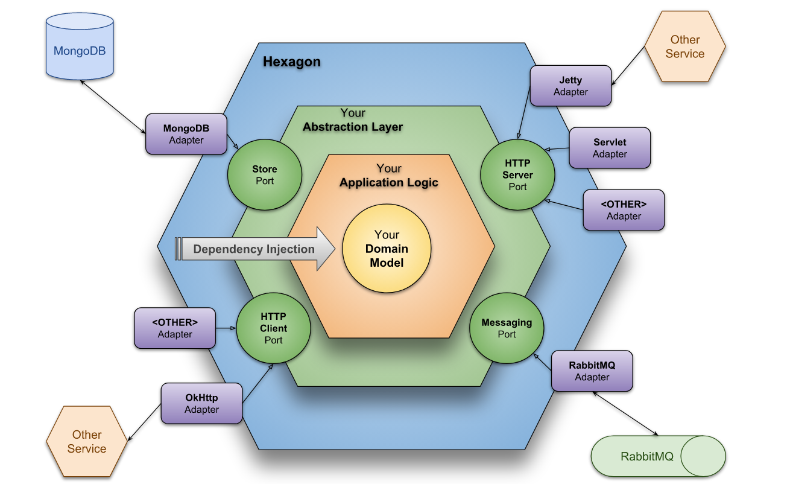

# ☕ Hexagonal Architecture + Spring

Esse projeto foi feito para explicar melhor sobre a arquitetura Hexagonal, podendo ter sido feito com qualquer outra linguagem ou framework.

#Arquitetura Hexagonal


# Modelagem da arquitetura em uma visão de componentes


## 🚀 Para rodar a app na sua máquina

1 - Inicialize a applicação
   
```shell script
mvn spring-boot:run
```
2 - Suba o container do banco PostgreSQL
```shell script
cd /docker
docker-compose up
```

# REST API
## Create Usuario
### Request
```
POST /usuario
```
```
curl -X POST http://localhost:8080/usuario -H 'content-type: application/json'  -d '{"nome":"Chimarrão","instagram":"@chimarrao","cep":"38400016"}'
```

```
{
	"nome":"Chimarrão",
	"instagram":"@chimarrao",
	"cep":"38400016"
}
```

### Response
```
{
    "id": 2,
    "nome": "Chimarrão",
    "instagram": "@chimarrao",
    "linkedin": null,
    "github": null,
    "dataNascimento": null,
    "endereco": {
        "cep": "38400-016",
        "logradouro": "Rua Segismundo Moraes",
        "uf": "MG",
        "cidade": null,
        "id": 2
    }
}
```